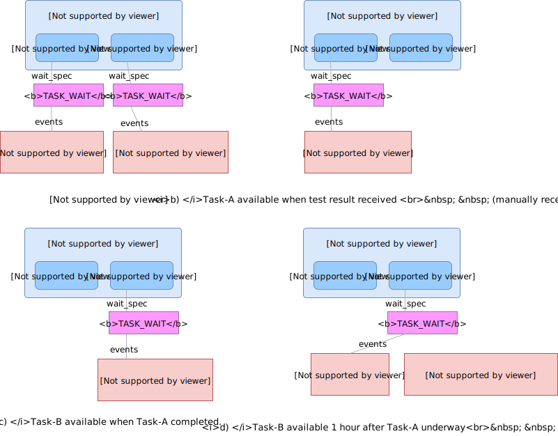

= Definition Model Patterns

This section describes typical workflow patterns in terms of the Definition Model described above.

== Timing Patterns

[.text-center]
.Timing Patterns

=== Clock Timing

=== Task-related Timing

=== State-related Timing

== Callback Patterns
